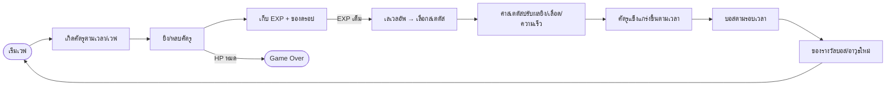

# Marfusha x Vampire Survivors (Kivy 2.5D Shooter)

เอกสารนี้สรุปภาพรวมแนวคิด, ระบบหลัก, รายชื่อฟังก์ชันสำคัญ และแผนพัฒนาทีละเฟส สำหรับเกมแนว Defense Shooter + Horde Survival ที่สร้างด้วย Kivy

## ภาพรวมเกม

- มุมมอง: 2.5D side-scrolling with depth (เดินซ้าย/ขวา + ขึ้น/ลงเพื่อเลี่ยงกระสุน)
- รูปแบบ: Wave-based, ศัตรูถาโถม, มีบอส, ตายแล้วจบ (roguelite)
- ลูปหลัก: เริ่มเวฟ → ยิงศัตรูเก็บ EXP → เลเวลอัพเลือกอัป Status → ศัตรูเก่งขึ้น/เยอะขึ้น → พบบอส → ดรอปไอเท็มพิเศษ → ตาย/ชนะเวฟ

### Gameplay Loop (Mermaid)



## การติดตั้ง & รัน

1. ติดตั้ง Python 3.9+ และ Kivy

```bash
pip install kivy
```

2. รันเกม (ไฟล์หลักสมมติชื่อ `main.py`)

```bash
python main.py
```

## สเตตัส RPG และผลลัพธ์ในเกม

| Status | ผลต่อเกม                                    |
| ------ | ------------------------------------------- |
| STR    | เพิ่มดาเมจ/แรงกระเด็นศัตรู                  |
| INT    | ลดคูลดาวน์สกิล, เพิ่มระยะเวลาโดรน/ป้อม      |
| AGI    | เพิ่มความเร็วเคลื่อนที่และรีโหลด            |
| VIT    | เพิ่ม Max HP และ HP regen                   |
| DEX    | เพิ่มอัตราการยิงและความแม่นยำ (ลด spread)   |
| LUCK   | เพิ่มโอกาส Critical และอัตราดรอปไอเท็ม/เงิน |

## ระบบหลักที่ควรมี

- **Input & Game Loop**: `Clock.schedule_interval` อัปเดต 60 FPS, รับคีย์บอร์ด/จอย
- **Rendering**: วาดด้วย `Canvas` (หลีกเลี่ยง widget ต่อศัตรู 1 ตัว), Z-sorting ตามแกน Y เพื่อให้ตัวล่างทับตัวบน
- **Entity Base**: จัดการตำแหน่ง x,y,z และการวาดสไปรต์/เรกแทงเกิล
- **Player**: เก็บสเตตัส, ยิง/คูลดาวน์, ระบบเลเวลอัพ/อัปสเตตัส, HP/รีเจน
- **Enemy Manager**: สุ่มเกิดศัตรูตามเวลา/ความยาก, รูปแบบเดินเข้าหาผู้เล่น, บอสตามรอบเวลา/เวฟ
- **Projectile/Bullet Pool**: ยิงตามค่า DEX/AGI, ใช้ object pooling เพื่อลด allocation
- **Collision System**: AABB สำหรับ กระสุน↔ศัตรู, ศัตรู↔ผู้เล่น
- **Progression**: EXP, Level, Popup เลือกสเตตัส (pause เกมชั่วคราวด้วย `Clock.unschedule`), ดรอปไอเท็มจาก LUCK
- **UI**: แถบ HP/EXP, ปุ่ม/คีย์สกิล, หน้าจอ Game Over, เมนูเริ่มเกม

## รายชื่อฟังก์ชัน/เมธอดที่แนะนำ

- `GameWidget.update(dt)`: ลูปหลัก อัปเดตอินพุต, ฟิสิกส์ง่ายๆ, ยิงอัตโนมัติ, เรนเดอร์
- `GameWidget.spawn_enemy(dt)`: สปาวน์ศัตรูเพิ่มความยากตามเวลา
- `GameWidget._on_keyboard_down/_on_keyboard_up`: เก็บสถานะปุ่ม
- `Player.shoot()` / `Player.can_shoot(dt)`: ยิงกระสุนตามคูลดาวน์ที่ขึ้นกับ DEX/AGI
- `Player.level_up(choice)`: อัปสเตตัส, รีคอมพิวต์ค่าส่งผลเกม (speed, damage, fire rate)
- `EnemyManager.update(dt)`: ขยับศัตรูเข้าหาผู้เล่น, เรียกบอสเมื่อถึงเวลา
- `CollisionSystem.resolve()`: ตรวจชน bullet↔enemy, player↔enemy, คำนวณดาเมจ/คริ/น็อคแบ็กจาก STR & LUCK
- `Renderer.draw_entities()`: เรียงตามแกน Y (z-order) แล้ววาด

## แผนการพัฒนา (Phases)

**Phase 0: Setup**

- เตรียม env Python/Kivy, สร้างโครงโปรเจ็กต์, ตั้ง Clock 60 FPS, หน้าจอเปล่าเดินได้

**Phase 1: Core Loop & Movement**

- ระบบอินพุต (คีย์บอร์ด/จอย), การเคลื่อนที่ 2.5D, กล้อง/ขอบจอ, เรนเดอร์พื้นฐานด้วย Canvas

**Phase 2: Combat**

- ยิงกระสุน, object pool, collision bullet↔enemy, STR/DEX/AGI มีผลดาเมจ/ความถี่/ความเร็วเดิน

**Phase 3: Progression**

- EXP/เลเวล, Popup เลือกสเตตัส, scaling ศัตรูตามเวลา/เวฟ, บอสและของดรอปพิเศษ, LUCK มีผลดรอป/คริ

**Phase 4: Content & Polish**

- สไปรต์/แอนิเมชัน, Z-sorting สวยงาม, UI HP/EXP/สกิล, เอฟเฟกต์เสียง, ปรับสมดุล, โปรไฟล์ประสิทธิภาพ

## Roadmap (ละเอียด)

**Phase 0: Setup & Skeleton**

- [ ] ตั้ง virtualenv, ติดตั้ง Kivy
- [ ] โครงไฟล์ `main.py`, `game.py`, `entities.py`, `systems/` (collision, renderer, enemy_manager)
- [ ] ตั้ง `Clock.schedule_interval` 60 FPS, หน้าจอเปล่า, debug overlay (FPS, entity count)

**Phase 1: Core Loop & Movement**

- [ ] อินพุตคีย์บอร์ด/จอย; pressed-keys set + key repeat
- [ ] การเคลื่อนที่ 2.5D (ซ้าย/ขวา/ขึ้น/ลง) พร้อมขอบจอ/กล้อง
- [ ] Entity base + z-order ตามแกน Y; renderer เรียงก่อนวาด
- [ ] ทดสอบ perf กับ 200+ เอนทิตี dummy เพื่อเช็ค Canvas update

**Phase 2: Combat Foundation**

- [ ] ระบบยิง + คูลดาวน์ขึ้นกับ DEX/AGI; auto-fire toggle
- [ ] Bullet object pool (reuse) + ค่า damage จาก STR, crit จาก LUCK
- [ ] Collision AABB bullet↔enemy + knockback scale ตาม STR
- [ ] EnemyManager: spawn timer, scaling ตามเวลา/เวฟ, pathing เข้าหาผู้เล่น

**Phase 3: Progression & Economy**

- [ ] ระบบ EXP/เลเวล; เกณฑ์เพิ่มตามเลเวล
- [ ] Popup เลือกอัปสเตตัส (pause เกมด้วย unschedule/resume)
- [ ] Loot/drop: โอกาสดรอปจาก LUCK, เงิน/ไอเท็มเติมเลือด
- [ ] Balance pass แรก: fire rate cap, damage falloff, enemy HP scaling

**Phase 4: Boss & Specials**

- [ ] Trigger บอสตามนาที/เวฟ; pattern การยิง/กระโดดหลบง่ายๆ
- [ ] รางวัลบอส: อาวุธใหม่/บัฟชั่วคราว, กล่องสุ่มเลือก 1 ใน 3
- [ ] ศัตรูพิเศษ (speedster/tank/ranged) เพื่อเพิ่ม variety

**Phase 5: UX/Polish**

- [ ] UI: HP/EXP bar, skill cooldown, kill/crit feed, pause/menu, game over
- [ ] สไปรต์/แอนิเมชัน + SFX พื้นฐาน (ยิง/โดน/ตาย/เลเวลอัพ)
- [ ] ปรับบาลานซ์รอบสอง + โปรไฟล์ประสิทธิภาพ (ลด canvas ops, batch draw)
- [ ] บันทึกสถิติรอบ (เวลารอด, kill, DPS, สเตตัสสุดท้าย)
