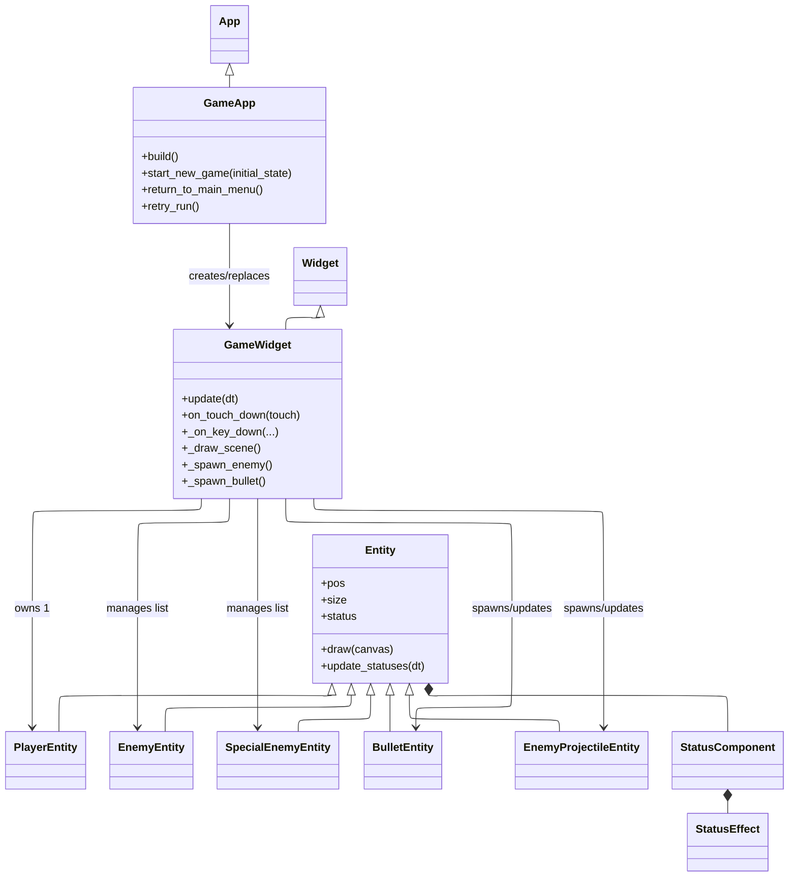
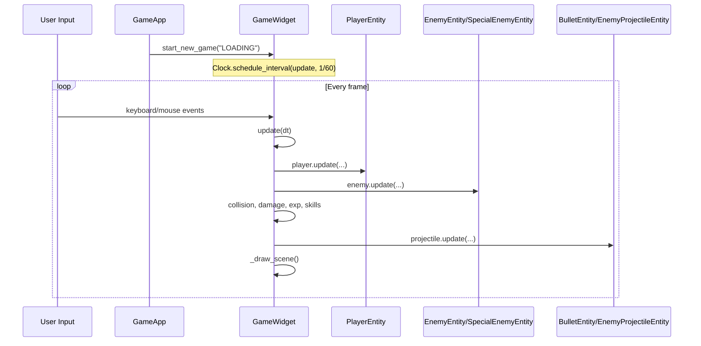

# Zombie Slayer: The Last Stand (Kivy 2D Shooter)

- psu6810110098 -> ณัฐพัชร์ ปิยกาญจน์
- psu6810110135 -> ธนพิพัฒน์ จันทร์สุวรรณ์

โปรเจกต์นี้เป็นเกมยิงมุมมอง 2.5D แบบเอาตัวรอด (horde survival) สร้างด้วย Kivy โดยใช้ `canvas` วาดทุกอย่างแบบ real-time ที่ 60 FPS

## ภาพรวมโปรแกรม

- แนวเกม: side-scrolling survival shooter
- เป้าหมาย: เอาชีวิตรอดให้ครบ `15:00` นาที
- โครงสร้างหลัก: `GameWidget` เป็นศูนย์กลางของ game loop, input, spawn, collision, render, และ UI
- ระบบที่มีในโค้ดปัจจุบัน:
  - ผู้เล่นพร้อมระบบ HP, กระสุน, reload, โหมดยิง, เลเวล/EXP, ค่าสเตตัส RPG
  - ศัตรูปกติ 4 ประเภท + บอส 3 ประเภท
  - สกิลกดใช้ `Dash`, `Grenade`, `Shockwave`, `Ultimate`
  - ระบบดรอป/เก็บ orb (EXP, Heal, Boss Reward)
  - เมนูครบ flow: Loading, Main Menu, Playing, Pause, Settings, Defeated, Victory

## การทำงานของโค้ด (Code Flow)

## 1) จุดเริ่มต้นโปรแกรม

- ไฟล์ `main.py`
  - สร้างคลาส `GameApp(App)`
  - ตั้งค่าหน้าต่าง (`1920x1080`) และชื่อเกม
  - สร้าง `GameWidget(initial_state="LOADING")`
  - มีเมธอดช่วยสลับเกมใหม่ เช่นกลับเมนูหรือเริ่มรอบใหม่

## 2) Game Loop กลาง

- ไฟล์ `game.py`
  - คลาส `GameWidget(Widget)`
  - ตั้งเวลาอัปเดตด้วย `Clock.schedule_interval(self.update, 1/60)`
  - ทุกเฟรม `update(dt)` จะจัดการตาม state ของเกม:
    - `LOADING` วาดหน้าจอโหลด
    - `MAIN_MENU` วาดเมนูหลัก
    - `PLAYING` อัปเดตระบบเกมทั้งหมด
    - `PAUSED/SETTINGS/DEFEATED/VICTORY` วาด overlay ตามสถานะ

## 3) ลำดับการอัปเดตตอนเล่น (`STATE_PLAYING`)

โดยสรุป `update()` จะทำตามลำดับหลักดังนี้:

1. อัปเดต cooldown สกิล, dash timer, ultimate timer
2. ปรับความยากตามเวลา (spawn interval / enemy speed)
3. อัปเดตผู้เล่น (`player.update`)
4. spawn ศัตรูปกติและศัตรูพิเศษตาม timer
5. อัปเดต AI ศัตรู + แยกตำแหน่งศัตรูไม่ให้ทับกัน (`_separate_enemies`)
6. จัดการยิงกระสุน/ชนกระสุน/ความเสียหาย/ฆ่าศัตรู
7. อัปเดต grenade, explosion, shockwave
8. อัปเดต projectile ของศัตรู
9. อัปเดตการดูดและเก็บ orb (EXP/Heal/Boss)
10. เช็ก melee hit จากศัตรูโดนผู้เล่น
11. ลบ entity ที่ตายและแสดงผลผ่าน `_draw_scene()`

## 4) ระบบ Entity

- `entity_base.py`
  - คลาสฐาน `Entity` (ตำแหน่ง, ขนาด, สี, status component)
  - เมธอดหลัก: `draw`, `move`, `get_status_multiplier`, `update_statuses`

- `player_entity.py`
  - คลาส `PlayerEntity`
  - โหลด animation (`idle`, `walk`, `run`, `shot`, `hurt`, `dead`, `recharge`)
  - ระบบ RPG stats: `str`, `dex`, `agi`, `int`, `vit`, `luck`
  - คำนวณค่าสู้รบจากสเตตัส เช่น `bullet_damage`, `fire_rate`, `max_hp`, `crit_chance`
  - ระบบยิง/กระสุน/reload และการคุม animation ตามสถานะ

- `enemy_entities.py`
  - `EnemyEntity`: ศัตรูปกติ 4 แบบ พร้อมสเตตัสแยกตามสกิน
  - `SpecialEnemyEntity`: บอส 3 แบบ
  - บอส Kitsune มี AI ระยะไกล, ยิงไฟ, และหลบกระสุน
  - มีระบบ preload texture และ hitbox แบบย่อขนาดเพื่อชนแม่นขึ้น

- `projectile_entities.py`
  - `BulletEntity` กระสุนผู้เล่น
  - `EnemyProjectileEntity` กระสุนศัตรู (เช่นไฟของ Kitsune)

- `status_system.py`
  - `StatusComponent` / `StatusEffect`
  - รองรับเอฟเฟกต์ตามเวลาและตัวคูณค่าสถานะ

- `entities.py`
  - เป็น facade รวม import ของ entity ทั้งหมดไว้ในที่เดียว

## Class Diagram และการเรียกใช้

### 1) Class Diagram (โครงสร้างคลาสหลัก)


```mermaid
---
config:
  layout: elk
---
classDiagram
  class App
  class Widget

  class GameApp {
    +build()
    +start_new_game(initial_state)
    +return_to_main_menu()
    +retry_run()
  }

  class GameWidget {
    +update(dt)
    +on_touch_down(touch)
    +_on_key_down(...)
    +_draw_scene()
    +_spawn_enemy()
    +_spawn_bullet()
  }

  class Entity {
    +pos
    +size
    +status
    +draw(canvas)
    +update_statuses(dt)
  }

  class PlayerEntity
  class EnemyEntity
  class SpecialEnemyEntity
  class BulletEntity
  class EnemyProjectileEntity

  class StatusComponent
  class StatusEffect

  App <|-- GameApp
  Widget <|-- GameWidget

  Entity <|-- PlayerEntity
  Entity <|-- EnemyEntity
  Entity <|-- SpecialEnemyEntity
  Entity <|-- BulletEntity
  Entity <|-- EnemyProjectileEntity

  Entity *-- StatusComponent
  StatusComponent *-- StatusEffect

  GameApp --> GameWidget : creates/replaces
  GameWidget --> PlayerEntity : owns 1
  GameWidget --> EnemyEntity : manages list
  GameWidget --> SpecialEnemyEntity : manages list
  GameWidget --> BulletEntity : spawns/updates
  GameWidget --> EnemyProjectileEntity : spawns/updates
```

### 2) เรียกใช้งานยังไง (Runtime Call Flow)


```mermaid
sequenceDiagram
  participant U as User Input
  participant A as GameApp
  participant G as GameWidget
  participant P as PlayerEntity
  participant E as EnemyEntity/SpecialEnemyEntity
  participant B as BulletEntity/EnemyProjectileEntity

  A->>G: start_new_game("LOADING")
  Note over G: Clock.schedule_interval(update, 1/60)

  loop Every frame
    U->>G: keyboard/mouse events
    G->>G: update(dt)
    G->>P: player.update(...)
    G->>E: enemy.update(...)
    G->>G: collision, damage, exp, skills
    G->>B: projectile.update(...)
    G->>G: _draw_scene()
  end
```

สรุปสั้น: `GameApp` ทำหน้าที่สร้าง/รีเซ็ต `GameWidget`, ส่วน `GameWidget` เป็นตัวกลางที่เรียกใช้งานทุกระบบในเฟรมเดียวตั้งแต่ input -> update -> collision -> render.

## รายละเอียดแต่ละคลาส (Class Reference)

### Core App และระบบหลัก

| Class        | ไฟล์      | หน้าที่                                                                            | State/Field สำคัญ                                                                                                                           | เมธอดหลักที่ใช้บ่อย                                                                                   |
| ------------ | --------- | ---------------------------------------------------------------------------------- | ------------------------------------------------------------------------------------------------------------------------------------------- | ----------------------------------------------------------------------------------------------------- |
| `GameApp`    | `main.py` | Entry point ของแอป Kivy, สร้างและสลับ `GameWidget`                                 | `root_container`, `game_widget`                                                                                                             | `build()`, `start_new_game()`, `return_to_main_menu()`, `retry_run()`                                 |
| `GameWidget` | `game.py` | ศูนย์กลางเกมทั้งหมด: state machine, game loop, input, spawn, collision, render, UI | `game_state`, `player`, `enemies`, `special_enemies`, `bullets`, `enemy_projectiles`, `skill_cooldowns`, `game_time`, `coins`, `kill_count` | `update()`, `_on_key_down()`, `on_touch_down()`, `_draw_scene()`, `_spawn_enemy()`, `_spawn_bullet()` |

### Base Entity และ Status System

| Class             | ไฟล์               | หน้าที่                                                     | State/Field สำคัญ                                    | เมธอดหลักที่ใช้บ่อย                                                |
| ----------------- | ------------------ | ----------------------------------------------------------- | ---------------------------------------------------- | ------------------------------------------------------------------ |
| `Entity`          | `entity_base.py`   | คลาสฐานสำหรับวัตถุที่มีตำแหน่ง/ขนาด และรองรับ status effect | `pos`, `size`, `color`, `status`                     | `draw()`, `move()`, `update_statuses()`, `get_status_multiplier()` |
| `StatusEffect`    | `status_system.py` | โครงสร้างข้อมูล effect เดี่ยว                               | `name`, `duration`, `potency`, `stacks`, `modifiers` | ใช้ผ่าน `StatusComponent` เป็นหลัก                                 |
| `StatusComponent` | `status_system.py` | ตัวจัดการ status ทั้งหมดของ entity                          | `_effects` (dict ของ effect)                         | `add()`, `remove()`, `has()`, `update()`, `get_multiplier()`       |

### Player, Enemy, Projectile

| Class                   | ไฟล์                     | หน้าที่                                                               | State/Field สำคัญ                                                                                      | เมธอดหลักที่ใช้บ่อย                                                                                                       |
| ----------------------- | ------------------------ | --------------------------------------------------------------------- | ------------------------------------------------------------------------------------------------------ | ------------------------------------------------------------------------------------------------------------------------- |
| `PlayerEntity`          | `player_entity.py`       | ผู้เล่นหลัก: เคลื่อนที่, animation, ยิง, reload, RPG stats, level/exp | `hp/max_hp`, `ammo/max_ammo`, `firing_modes`, `str/dex/agi/int/vit/luck`, `bullet_damage`, `fire_rate` | `update()`, `take_damage()`, `start_shooting()`, `stop_shooting()`, `add_experience()`, `allocate_stat()`, `get_hitbox()` |
| `EnemyEntity`           | `enemy_entities.py`      | ศัตรูปกติ 4 แบบ พร้อม stats ต่อสกินและ melee attack                   | `SKINS`, `SKIN_STATS`, `hp/max_hp`, `speed`, `damage`, `is_dying`                                      | `preload_all_skins()`, `update()`, `take_damage()`, `get_hitbox()`, `get_attack_hitbox()`                                 |
| `SpecialEnemyEntity`    | `enemy_entities.py`      | ศัตรูพิเศษ/บอส 3 แบบ (รวม AI พิเศษของ Kitsune)                        | `SKINS`, `ANIMATION_FRAMES`, `SKIN_STATS`, `ai_state`, `fire_timer`, `fire_cooldown`                   | `preload_all_skins()`, `update()`, `_update_kitsune_ai()`, `take_damage()`, `get_hitbox()`                                |
| `BulletEntity`          | `projectile_entities.py` | กระสุนผู้เล่น เคลื่อนที่ตามทิศที่ยิงและชนศัตรู                        | `velocity`, `angle`, `speed`                                                                           | `update()`, `draw()`, `get_hitbox()`                                                                                      |
| `EnemyProjectileEntity` | `projectile_entities.py` | กระสุนของศัตรูระยะไกล (เช่น Kitsune fire)                             | `velocity`, `angle`, `fire_textures`, `current_frame`                                                  | `update()`, `draw()`, `get_hitbox()`                                                                                      |

### Runtime Helper Classes ใน `game.py`

| Class             | หน้าที่                                          | State/Field สำคัญ                                              | เมธอดหลัก                                             |
| ----------------- | ------------------------------------------------ | -------------------------------------------------------------- | ----------------------------------------------------- |
| `ExpOrb`          | ดรอป EXP ที่ถูกดูดเข้าผู้เล่น                    | `exp_value`, `base_pull_speed`, `max_pull_speed`               | `update()`, `draw()`, `get_hitbox()`                  |
| `BossOrb`         | ดรอปจากบอสเพื่อเปิด boss upgrade choice          | `size`, `base_pull_speed`, `max_pull_speed`                    | `update()`, `draw()`, `get_hitbox()`                  |
| `HealthOrb`       | ดรอปฮีลฟื้น HP ตามสัดส่วน max HP                 | `heal_ratio`, `lifetime`, `age`                                | `update()`, `is_expired()`, `draw()`, `get_hitbox()`  |
| `GrenadeEntity`   | โปรเจกไทล์ระเบิด (มี fuse time และ blast radius) | `damage`, `blast_radius`, `time_left`, `velocity`, `fuse_time` | `update()`, `is_exploded()`, `draw()`, `get_hitbox()` |
| `ShockwaveEffect` | visual effect วงช็อกเวฟหลังใช้สกิล               | `radius`, `max_radius`, `lifetime`, `done`                     | `update()`, `draw()`                                  |
| `ExplosionEffect` | visual effect ระเบิด (grenade/ultimate)          | `textures`, `current_frame`, `size`, `done`                    | `update()`, `draw()`                                  |

### คลาสไหนเรียกคลาสไหนบ่อยที่สุด

- `GameApp` -> สร้าง/เปลี่ยน `GameWidget`
- `GameWidget` -> เรียก `PlayerEntity.update()` ทุกเฟรม
- `GameWidget` -> spawn และเรียก `EnemyEntity.update()` / `SpecialEnemyEntity.update()` ทุกเฟรม
- `GameWidget` -> spawn และอัปเดต `BulletEntity` / `EnemyProjectileEntity`
- `GameWidget` -> ใช้ `ExpOrb`, `HealthOrb`, `BossOrb`, `GrenadeEntity`, `ShockwaveEffect`, `ExplosionEffect` เป็น object runtime ระหว่างการต่อสู้
- `Entity` ทุกตัว -> พึ่ง `StatusComponent` สำหรับบัฟ/ดีบัฟที่หมดเวลาได้

## 5) ระบบ Progression และสกิล

- เมื่อฆ่าศัตรูจะได้ EXP orb และ coins
- เลเวลอัปจะขึ้นหน้าต่างให้เลือกอัปเกรด 3 ตัวเลือก
- บอสตายจะดรอป `BossOrb` และเปิดหน้าต่างเลือกบัฟคูณ x1.5
- สกิลในปัจจุบัน:
  - `Q`: Dash (มี i-frame ช่วงสั้น)
  - `E`: Grenade (ดาเมจวงระเบิดตาม STR/INT)
  - `2`: Shockwave (ผลักศัตรูรอบตัว)
  - `1`: Ultimate (กระสุนไม่จำกัดชั่วคราว)

## การควบคุม (Controls)

- เคลื่อนที่: `W`, `A`, `S`, `D`
- วิ่ง: กด `Shift` ค้าง
- ยิง: เมาส์ซ้ายค้าง
- Reload: `R`
- เปลี่ยนโหมดยิง: `V` (`AUTO`, `SEMI`, `SINGLE`)
- สกิล: `Q`, `E`, `2`, `1`
- เลือกอัปเกรดตอน Level Up/Boss Reward: กด `1`/`2`/`3` หรือคลิกการ์ด
- Pause/Resume: `Esc`

## ปุ่ม Debug

- เปิด/ปิด Debug Mode: `9`
- God Mode: `8`
- Spawn ศัตรูปกติ: `+` หรือ `=`
- Spawn บอสเฉพาะ:
  - `7` = Gorgon
  - `5` = Kitsune
  - `6` = Red Werewolf
- ปรับความเร็วเวลาในเกม: `-`
- สลับ balance preset: `0`

## โครงสร้างไฟล์สำคัญ

```text
main.py                # Entry point ของแอป
game.py                # GameWidget, game loop, state flow, render, UI
entity_base.py         # คลาสฐาน Entity
player_entity.py       # ผู้เล่นและ progression stats
enemy_entities.py      # ศัตรูปกติ/พิเศษและ AI
projectile_entities.py # กระสุนผู้เล่น/ศัตรู
status_system.py       # ระบบ status effect
entities.py            # re-export facade ของ entities
game_picture/          # รูปพื้นหลัง, sprite, UI
game_sounds/           # เสียงเกม
```

## วิธีรันโปรแกรม

## 1) สิ่งที่ต้องมี

- Python 3.10+ (แนะนำ)
- ติดตั้งแพ็กเกจ `kivy`

## 2) ติดตั้ง dependency

```bash
pip install kivy
```

ถ้าต้องการแยก environment แนะนำ:

```bash
python -m venv .venv
source .venv/bin/activate
pip install --upgrade pip
pip install kivy
```

## 3) รันเกม

```bash
python main.py
```

## 4) การทดสอบเร็วหลังรัน

1. เข้า Main Menu แล้วกด `Play`
2. ลองเดิน (`WASD`) และยิง (เมาส์ซ้าย)
3. ลอง `R` reload และ `V` เปลี่ยนโหมดยิง
4. ลองกดสกิล `Q/E/2/1`
5. กด `9` แล้วทดสอบ debug keys

## หมายเหตุ

- เกมใช้ asset path ค่อนข้างตรงตัว ควรคงโครงสร้างโฟลเดอร์ `game_picture/` และ `game_sounds/` เดิมไว้
- ถ้าหน้าต่างไม่ขึ้น/ไม่มีเสียง ให้ตรวจเวอร์ชัน Kivy และความครบของไฟล์ asset ก่อน
